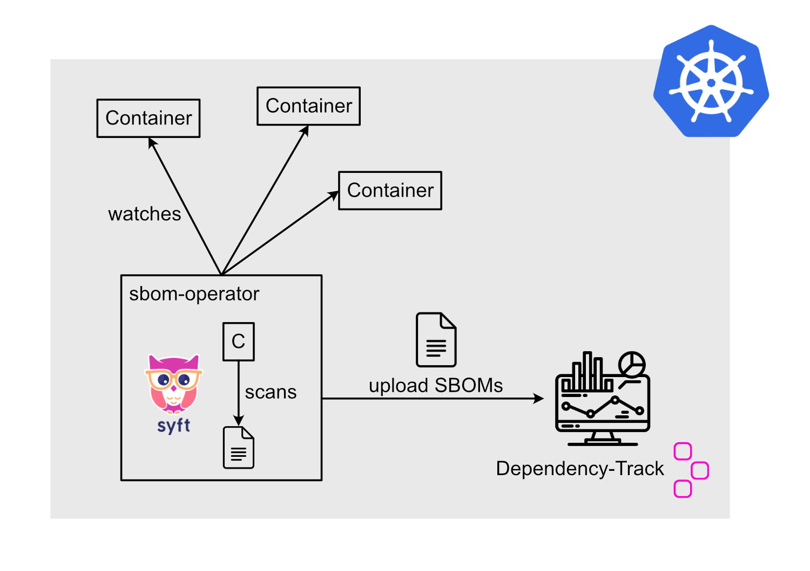
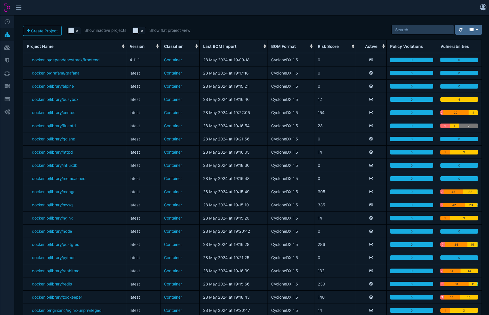

# Deploy Dependency-Track with sbom-operator in a local kind cluster

This guide describes how to deploy Dependency-Track with the sbom-operator in a local kind cluster.



## Prerequisites

- [kind](https://kind.sigs.k8s.io/)
- [helm](https://helm.sh/)
- [kubectl](https://kubernetes.io/docs/tasks/tools/install-kubectl/)

Clone the repository and navigate to the deployment folder.

```bash
git clone git@github.com:sahma19/podsalsa.git
# https: git clone https://github.com/sahma19/podsalsa.git

cd podsalsa/docs/component-analysis/dependency-track/deployment
```

## Install local kind cluster

Install [kind](https://kind.sigs.k8s.io/) and create a local cluster.

```bash
# install kind
brew install kind

# create local cluster
kind create cluster --config=kind-config.yaml
```

## Deploy Dependency-Track

Install Dependency-Track with the following commands:

```bash
helm repo add dependencytrack https://dependencytrack.github.io/helm-charts
helm repo update

helm install dependencytrack dependencytrack/dependency-track \
    -n dependencytrack --create-namespace -f values-dtrack.yaml

# check if the deployment is ready
kubectl get pods -n dependencytrack 
```

## Create API token in Dependency-Track

Open the browser and navigate to [http://0.0.0.0:30081](http://0.0.0.0:30081) and login with the default credentials `admin` and `admin`.

Create a new API key for the `Automation` team in the `Configuration/Access Management/Teams` section. Following permissions are required:

- `BOM_UPLOAD`
- `PORTFOLIO_MANAGEMENT`
- `PROJECT_CREATION_UPLOAD`
- `VIEW_PORTFOLIO`
- `VIEW_VULNERABILITY`
- `VULNERABILITY_ANALYSIS`
- `VULNERABILITY_MANAGEMENT`

Copy the API token and export it as an environment variable:

```bash
export API_TOKEN=odt_xxx
```

## Deploy sbom-operator

Install the sbom-operator with the following commands:

```bash
helm repo add ckotzbauer https://ckotzbauer.github.io/helm-charts
helm repo update

# create namespace and secret
kubectl create ns sbom-operator
kubectl create secret generic \
    --from-literal=accessToken=$API_TOKEN \
    sbom-operator -n sbom-operator

# install sbom-operator
helm install sbom-operator ckotzbauer/sbom-operator \
    -n sbom-operator --create-namespace \
    -f values-sbom-operator.yaml

# check if the deployment is ready
kubectl get pods -n sbom-operator
```

## Deploy some pods

Deploy some sample pods to the cluster:

```bash
kubectl apply -f sample-pods.yaml
```

The sbom-operator will now create SBOMs for the pods and upload them to Dependency-Track. It will take some time until all the SBOMs are uploaded and scanned.

## Check Dependency-Track

Verify that the SBOMs are uploaded to Dependency-Track and the vulnerabilities are scanned: [http://0.0.0.0:30081](http://0.0.0.0:30081).



You could also upload SBOMs manually to the api [http://0.0.0.0:30080](http://0.0.0.0:30080) (see [manual sbom import](../manual-sbom-import.md))

## Cleanup

Delete the local kind cluster:

```bash
kind delete cluster
```
